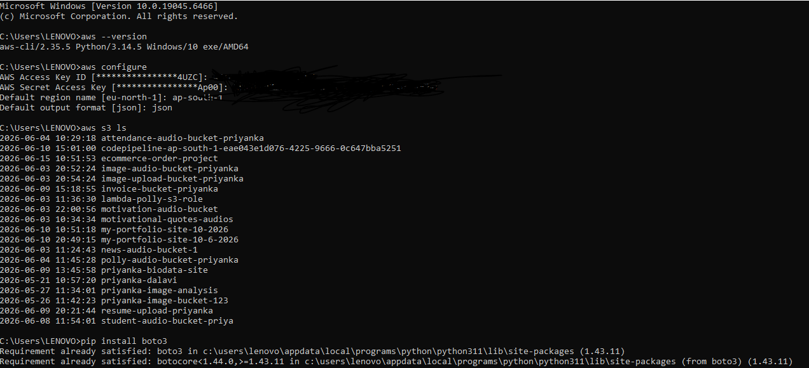
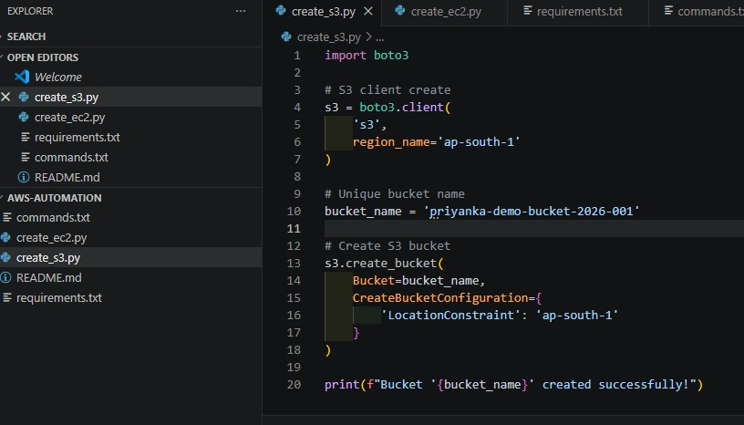

# AWS Resource Provisioning using Boto3

## Project Overview

This project demonstrates AWS Infrastructure Automation using Python and Boto3.

Instead of manually creating AWS resources through the AWS Management Console, resources are provisioned automatically using Python scripts.

## AWS Services Used

* AWS IAM
* AWS CLI
* Amazon S3
* Amazon EC2
* Python
* Boto3

## Project Files

### create_s3.py

Automates Amazon S3 bucket creation using Python and Boto3.

### create_ec2.py

Automates Amazon EC2 instance provisioning using Python and Boto3.

### requirements.txt

Contains required Python packages.

### commands.txt

Contains commands used during project execution.

## Prerequisites

* AWS Account
* IAM User with programmatic access
* AWS CLI configured
* Python installed
* Boto3 installed

## Installation

Install Boto3:

pip install boto3

Configure AWS CLI:

aws configure

## Run the Scripts

Create S3 Bucket:

python create_s3.py

Create EC2 Instance:

python create_ec2.py

## Project Workflow

Python Script
→ Boto3 SDK
→ AWS API
→ AWS Resources (S3 / EC2)

## Learning Outcomes

* AWS CLI Configuration
* IAM Authentication
* Boto3 SDK Usage
* Amazon S3 Automation
* Amazon EC2 Automation
* Infrastructure as Code (IaC)

## Project Screenshots

### AWS CLI Configuration

### S3 Automation Script

### S3 Bucket Created

## Author
Priyanka Dalavi
